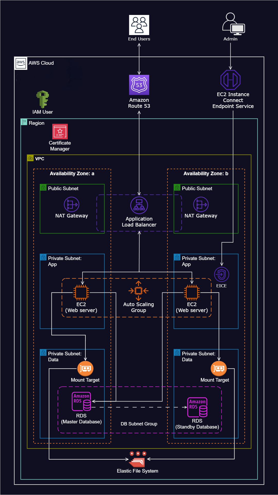

# WordPress Website Deployment on AWS

## Project Overview
This project demonstrates the deployment of a WordPress website on AWS using various AWS services to ensure high availability, security, and scalability. The reference architecture, along with the scripts used for deployment, is available in the project's GitHub repository.
---
## Architecture Components
1. **Virtual Private Cloud (VPC):** Configured with public and private subnets across two Availability Zones.

---
2. **Internet Gateway:** Enables connectivity between the VPC instances and the Internet.
---
3. **Security Groups:** Implemented as a firewall mechanism to regulate traffic.

---
4. **Availability Zones:** Utilized for system reliability and fault tolerance.

---
5. **Public Subnets:** Assigned for infrastructure components like the NAT Gateway and Application Load Balancer.

---
6. **EC2 Instance Connect Endpoint:** Allows secure access to instances in both public and private subnets.

---
7. **Private Subnets:** Hosts web servers (EC2 instances) for enhanced security.

---
8. **NAT Gateway:** Enables instances in private subnets to access the Internet securely.

---
9. **EC2 Instances:** Hosts the WordPress website.

---
10. **Application Load Balancer (ALB):** Distributes web traffic evenly to an Auto Scaling Group of EC2 instances.


---
11. **Auto Scaling Group (ASG):** Manages EC2 instances automatically for scalability and availability.

---
12. **GitHub:** Used for version control and collaboration on web files.
---
13. **AWS Certificate Manager:** Secures application communications with SSL/TLS.

---
14. **AWS Simple Notification Service (SNS):** Sends alerts about Auto Scaling Group activities.

---
15. **Route 53:** Handles domain name registration and DNS records.

---
16. **Elastic File System (EFS):** Provides a shared file system for web files.

---
17. **Relational Database Service (RDS):** Manages the database for WordPress.


---
## Installation and Deployment
### WordPress Installation Script
The following script is used to set up WordPress on an EC2 instance:
```bash
sudo su
sudo yum update -y
sudo mkdir -p /var/www/html
EFS_DNS_NAME=fs-064e9505819af10a4.efs.us-east-1.amazonaws.com
sudo mount -t nfs4 -o nfsvers=4.1,rsize=1048576,wsize=1048576,hard,timeo=600,retrans=2,noresvport "$EFS_DNS_NAME":/ /var/www/html
sudo yum install -y httpd
sudo systemctl enable httpd
sudo systemctl start httpd
sudo dnf install -y \
php php-cli php-cgi php-curl php-mbstring php-gd php-mysqlnd \
php-gettext php-json php-xml php-fpm php-intl php-zip php-bcmath \
php-ctype php-fileinfo php-openssl php-pdo php-tokenizer
sudo wget https://dev.mysql.com/get/mysql80-community-release-el9-1.noarch.rpm
sudo dnf install -y mysql80-community-release-el9-1.noarch.rpm
sudo rpm --import https://repo.mysql.com/RPM-GPG-KEY-mysql-2023
sudo dnf repolist enabled | grep "mysql.*-community.*"
sudo dnf install -y mysql-community-server
sudo systemctl start mysqld
sudo systemctl enable mysqld
sudo usermod -a -G apache ec2-user
sudo chown -R ec2-user:apache /var/www
sudo chmod 2775 /var/www && find /var/www -type d -exec sudo chmod 2775 {} \;
sudo find /var/www -type f -exec sudo chmod 0664 {} \;
chown apache:apache -R /var/www/html
wget https://wordpress.org/latest.tar.gz
tar -xzf latest.tar.gz
sudo cp -r wordpress/* /var/www/html/
sudo cp /var/www/html/wp-config-sample.php /var/www/html/wp-config.php
sudo vi /var/www/html/wp-config.php
sudo service httpd restart
```

### Auto Scaling Group Launch Template Script
The following script is used for launching EC2 instances within an Auto Scaling Group:
```bash
#!/bin/bash
sudo yum update -y
sudo yum install -y httpd
sudo systemctl enable httpd
sudo systemctl start httpd
sudo dnf install -y \
php php-cli php-cgi php-curl php-mbstring php-gd php-mysqlnd \
php-gettext php-json php-xml php-fpm php-intl php-zip php-bcmath \
php-ctype php-fileinfo php-openssl php-pdo php-tokenizer
sudo wget https://dev.mysql.com/get/mysql80-community-release-el9-1.noarch.rpm
sudo dnf install -y mysql80-community-release-el9-1.noarch.rpm
sudo rpm --import https://repo.mysql.com/RPM-GPG-KEY-mysql-2023
sudo dnf repolist enabled | grep "mysql.*-community.*"
sudo dnf install -y mysql-community-server
sudo systemctl start mysqld
sudo systemctl enable mysqld
EFS_DNS_NAME=fs-02d3268559aa2a318.efs.us-east-1.amazonaws.com
echo "$EFS_DNS_NAME:/ /var/www/html nfs4 nfsvers=4.1,rsize=1048576,wsize=1048576,hard,timeo=600,retrans=2 0 0" >> /etc/fstab
mount -a
chown apache:apache -R /var/www/html
sudo service httpd restart
```

## Usage
After setting up the infrastructure and executing the scripts, navigate to the registered domain in a web browser to access the WordPress website.

## Conclusion
This project effectively demonstrates the use of AWS services to host a highly available, secure, and scalable WordPress website. The implementation leverages best practices for networking, security, and automation to ensure seamless operation.

For more details, refer to the project's GitHub repository.


